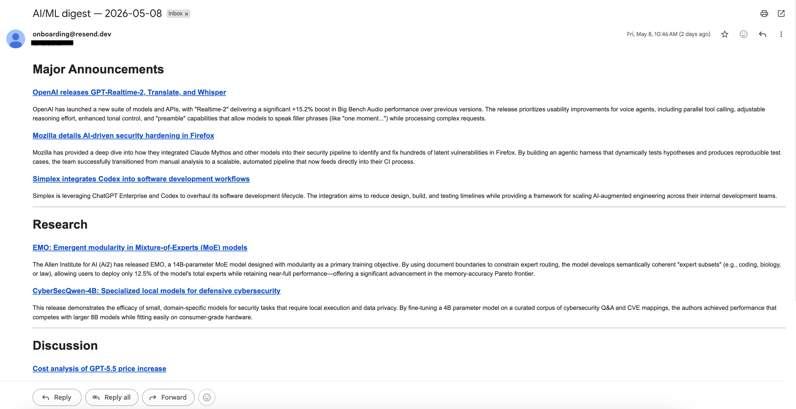

# AI news digest agent

Daily AI/ML news digest. Fetches a curated set of sources, asks an LLM to
filter and summarize the items worth surfacing, and emails a markdown digest.
Runs on GitHub Actions at 15:17 UTC.

Built as a personal tool — I wanted a single morning email summarizing
what's worth attention across AI labs, ML research, and developer community
discussion, without scrolling through ten feeds.

## Architecture

Pipeline runs in four stages: **fetch → filter → curate → email**.

- **Fetch** (`fetchers/`). One module per source kind (`rss`,
  `anthropic_blog`, `hn`), dispatched on `Source.kind`. Failures are
  returned, not raised, so a single broken source never stops the run.
- **Filter** (`main.py`). Items older than seven days are dropped, then
  deduplicated against a 14-day URL set persisted in
  `data/seen_items.json`.
- **Curate** (`curator.py`). Surviving items are passed to an LLM with a
  single tool, `fetch_full_article(url)`, that the model can call when a
  snippet is too thin to judge. Tool calls are subject to a per-run
  hostname allowlist built from the source registry plus HN-linked URLs
  in the current batch — exact-host match, redirect targets re-checked.
  This is the prompt-injection boundary: untrusted article text cannot
  cause the tool to reach hosts outside the allowlist.
- **Email** (`emailer.py`). Markdown is rendered to HTML and sent via
  Resend, with the raw markdown as the plain-text fallback.

`config.LLM_PROVIDER` selects the provider (`anthropic` or `gemini`); both
implement the same `run_tool_use_loop` contract, so the curator is
provider-agnostic.

## State

Three files in `data/`, committed back to the repo by the workflow each run:

- `seen_items.json` — URL-keyed dedup set, entries expire after 14 days.
  Only updated on successful email send.
- `source_health.json` — per-source success/failure log. Failures appear
  as a footer on the digest.
- `token_usage.jsonl` — append-only per-run record of tokens, tool calls,
  timing, and errors.

## Setup

```
git clone <repo>
cd ai-news-digest-agent
python3 -m venv .venv
source .venv/bin/activate
pip install -r requirements.txt
cp .env.example .env
# fill in the secrets below
```

Secrets, set in `.env` for local runs and in GitHub Secrets for CI:

- `ANTHROPIC_API_KEY` (required if `LLM_PROVIDER = "anthropic"`)
- `GEMINI_API_KEY` (required if `LLM_PROVIDER = "gemini"`)
- `RESEND_API_KEY`
- `RECIPIENT_EMAIL`

Run locally:

```
python main.py
```

## Provider rate limits

Anthropic Tier 1 input token rate limit is 30K/min, which can be exceeded
on heavy news days with the default `SNIPPET_CHARS` and a full batch. If
using `LLM_PROVIDER = "anthropic"` on Tier 1, reduce `SNIPPET_CHARS` in
`config.py` from 1500 to ~1000, or switch to `LLM_PROVIDER = "gemini"` —
Gemini Tier 1 limits are significantly higher.

## Example digest



## Operational notes

- If email send fails, `seen_items.json` is not updated, so the next run
  retries the same items. RSS feeds with short windows can still drop
  items between a failed and a successful send — fix email failures
  promptly. A future improvement is to persist unsent digests to a
  pending file and retry on the next run.
- `source_health.json` and `token_usage.jsonl` are written even when the
  run fails, so post-mortem data isn't lost.